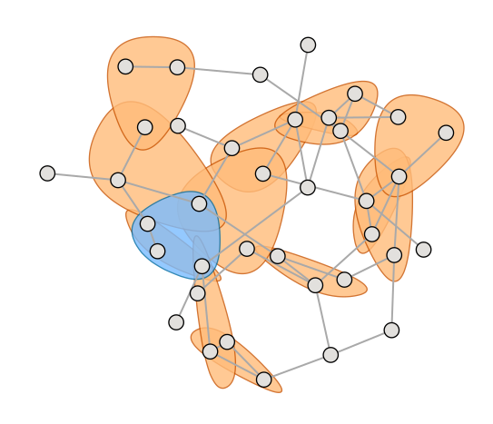

**Hypergraphx** (HGX) is a Python library for the analysis of real-world complex systems with **group interactions**. It provides a comprehensive suite of tools to construct, visualize, and analyze **hypergraphs** with weighted, directed, temporal, and multiplex interactions. HGX aims to provide, as a single source, a wide range of tools for higher‑order data: conversions across representations, measures of higher‑order organization, filtering and sparsification, generative models, and dynamical processes from contagion to synchronization. The framework is general and designed to be user‑friendly and accessible.

[](https://hypergraphx.readthedocs.io/) [](https://arxiv.org/abs/2303.15356) [](https://github.com/HGX-Team/hypergraphx/tree/master/tutorials)   [](https://github.com/HGX-Team/hypergraphx/issues) [](https://github.com/HGX-Team/data)   [](mailto:quintino.lotito@unitn.it)

## 🧭 Menu

- [What are higher-order networks?](#-what-are-higher-order-networks)
- [Quick start](#-quick-start)
- [Library highlights](#-library-highlights)
- [Tutorials and data](#-tutorials-and-data)
- [The HGX team](#-the-hgx-team)
- [Acknowledgments](#-acknowledgments)
- [Citing HGX](#-citing-hgx)
- [Contributing](#-contributing)
- [License](#-license)
- [Other resources](#-other-resources)

## 🌐 What are higher-order networks?

Networks capture pairwise (dyadic) interactions. But many real systems involve groups of three or more units acting together: cellular networks, drug recombination, brain networks, face‑to‑face interactions, collaboration teams. Hypergraphs model these **higher‑order interactions** directly, with hyperedges that connect any number of nodes.



## 🚀 Quick start

### Install

```bash
pip install hypergraphx
```

Latest (from GitHub):

```bash
pip install hypergraphx@git+https://github.com/HGX-Team/hypergraphx
```

### Create a hypergraph

```python
from hypergraphx import Hypergraph

H = Hypergraph(edge_list=[(1, 2, 3), (2, 4)])
print(H.num_nodes(), H.num_edges())
print(H.get_neighbors(2))
```

### Add weights and metadata

```python
H = Hypergraph(
    edge_list=[("A", "B"), ("B", "C")],
    weighted=True,
    weights=[1.2, 0.7],
    node_metadata={"A": {"role": "source"}},
    edge_metadata=[{"type": "interaction"}, {"type": "interaction"}],
)

print(H.get_weight(("A", "B")))
print(H.get_node_metadata("A"))
```

### Convert and analyze

```python
line_graph = H.to_line_graph()
print(line_graph.number_of_nodes())
```

### Linear algebra (matrices)

```python
from hypergraphx.linalg import laplacian_matrix_by_order

# Node-indexed incidence + node mapping (row index -> node label)
B, node_map = H.binary_incidence_matrix(return_mapping=True)

# Node-indexed adjacency (CSR by default)
A = H.adjacency_matrix()

# Order-specific Laplacian + mapping
L2, node_map = laplacian_matrix_by_order(H, order=2, return_mapping=True)

# Example: a few smallest eigenvalues
from scipy.sparse.linalg import eigsh

eigs = eigsh(L2, k=5, which="SM", return_eigenvectors=False)
print(eigs)
```

### Temporal interactions (at a glance)

```python
from hypergraphx import TemporalHypergraph

T = TemporalHypergraph()
T.add_edge(("A", "B"), time=1)
T.add_edge(("A", "B", "C"), time=2)
print(T.get_edges(time_window=(1, 3)))
```

## 🧰 Library highlights

- **Representations and transforms**: hypergraphs, bipartite networks, line graphs, clique expansions, duals.
- **Measures and statistics**: degrees, correlations, assortativity, motifs, and mesoscale structure.
- **Centrality and motifs**: spectral approaches, shortest paths, betweenness flows, motif sampling.
- **Communities and inference**: hard and overlapping communities, assortative/disassortative structure.
- **Filtering**: statistically validated hypergraphs and significant interacting groups.
- **Generative models**: Erdos-Renyi, scale-free, configuration, community-based, temporal activity-driven.
- **Dynamics**: synchronization, social contagion, random walks, diffusion.
- **Rich semantics**: weighted, directed, temporal, multiplex, signed interactions.

## 📎 Tutorials and data

If you are new to higher‑order networks, start with the introductory notebooks. The tutorials cover:
- building hypergraphs from data
- computing measures and centralities
- filtering and sampling
- community detection and inference
- temporal and multiplex workflows

Tutorials: https://github.com/HGX-Team/hypergraphx/tree/master/tutorials

Datasets: https://github.com/HGX-Team/data

## 👥 The HGX team

Project coordinators
- Quintino Francesco Lotito (lead developer) · 🐦 [Twitter](https://twitter.com/FraLotito) · 🐙 [GitHub](https://github.com/FraLotito)
- Federico Battiston (project coordinator) · 🔗 [Website](https://people.ceu.edu/federico_battiston) · 🐦 [Twitter](https://twitter.com/fede7j) · 🐙 [GitHub](https://github.com/fede7j)

Contributors
- Lorenzo Betti · 🐦 [Twitter](https://x.com/LoreBetti) · 🐙 [GitHub](https://github.com/Loreb92)
- Alberto Ceria · 🐦 [Twitter](https://twitter.com/cerialbo)
- Davide Colosimo
- Martina Contisciani · 🐦 [Twitter](https://twitter.com/mcontisc) · 🐙 [GitHub](https://github.com/mcontisc)
- Caterina De Bacco · 🔗 [Website](https://www.cdebacco.com/) · 🐙 [GitHub](https://github.com/cdebacco)
- Leonardo Di Gaetano · 🐦 [Twitter](https://twitter.com/leodigaetano) · 🐙 [GitHub](https://github.com/LeonardoDiGaetano)
- Helcio Felippe · 🐦 [Twitter](https://x.com/juniorfelippe)
- Luca Gallo · 🐦 [Twitter](https://twitter.com/l_gajo) · 🐙 [GitHub](https://github.com/lgajo)
- Alec Kirkley · 🔗 [Website](https://aleckirkley.com/) · 🐦 [Twitter](https://x.com/captainkirk1041) · 🐙 [GitHub](https://github.com/aleckirkley)
- Alberto Montresor · 🔗 [Website](http://cricca.disi.unitn.it/montresor/)
- Federico Musciotto · 🐦 [Twitter](https://twitter.com/musci8) · 🐙 [GitHub](https://github.com/musci8)
- Berné Nortier · 🐙 [GitHub](https://github.com/joanne-b-nortier)
- Nicolò Ruggeri · 🔗 [Website](https://nickruggeri.github.io/) · 🐦 [Twitter](https://twitter.com/NikRuggeri) · 🐙 [GitHub](https://github.com/nickruggeri)
- Alberto Vendramini

## 🧾 Citing HGX

```bibtex
@article{lotito2023hypergraphx,
    author = {Lotito, Quintino Francesco and Contisciani, Martina and De Bacco, Caterina and Di Gaetano, Leonardo and Gallo, Luca and Montresor, Alberto and Musciotto, Federico and Ruggeri, Nicolo and Battiston, Federico},
    title = "{Hypergraphx: a library for higher-order network analysis}",
    journal = {Journal of Complex Networks},
    volume = {11},
    number = {3},
    year = {2023},
    month = {05},
    issn = {2051-1329},
    doi = {10.1093/comnet/cnad019},
    url = {https://doi.org/10.1093/comnet/cnad019},
    note = {cnad019},
    eprint = {https://academic.oup.com/comnet/article-pdf/11/3/cnad019/50461094/cnad019.pdf},
}
```

## 🤝 Contributing

HGX is a collaborative project and we welcome suggestions and contributions. If you are interested in contributing to
HGX or have any questions about our project, please do not hesitate to reach out to us.

:running: **I only have 1 minute**

- Tweet about our library and spread the voice!
- Give the project a star on GitHub :star:!

:hourglass_flowing_sand: **I've got 10 minutes**

- Are you interested in higher-order motif analysis or community detection in hypergraphs? Try out
  our [tutorials](https://github.com/HGX-Team/hypergraphx/tree/master/tutorials)!
- [Suggest](https://github.com/HGX-Team/hypergraphx/issues) ideas and engage in discussions
- [Help](https://github.com/HGX-Team/hypergraphx/issues) someone with a problem
- [Report a bug](https://github.com/HGX-Team/hypergraphx/issues) someone with a problem

:computer: **I've got a few hours to work on this**

- Create new tools for the community
- Help solving bugs reported in the [issues](https://github.com/HGX-Team/hypergraphx/issues)
- Please read the more detailed [contributing guidelines](CONTRIBUTING.md)

:tada: **I want to help grow the community**

- Spread the voice!
- Talk about how HGX has been useful for your research problem
- Engage in a discussion with the core members of the library

## 📜 License

Released under the 3-Clause BSD license. See [LICENSE.md](LICENSE.md).

## 🙏 Acknowledgments

This project is supported by the Air Force Office of Scientific Research under award number FA8655-22-1-7025.

HGX contains copied or modified code from third sources. The licenses of such code sources can be found in [LICENSE.md](LICENSE.md).
